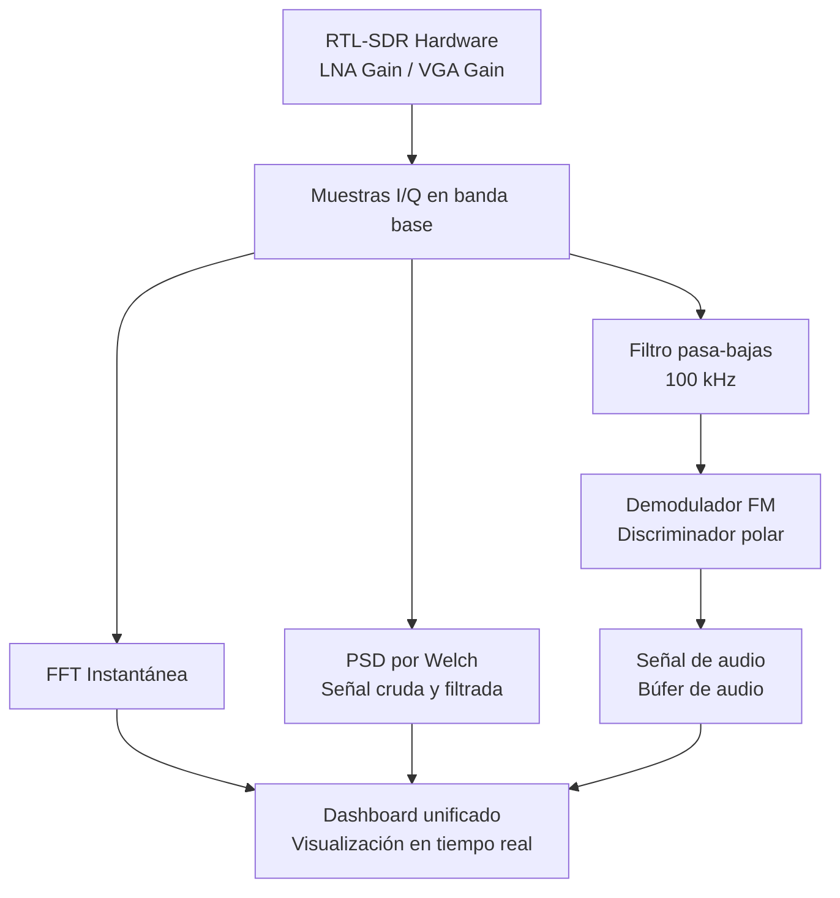
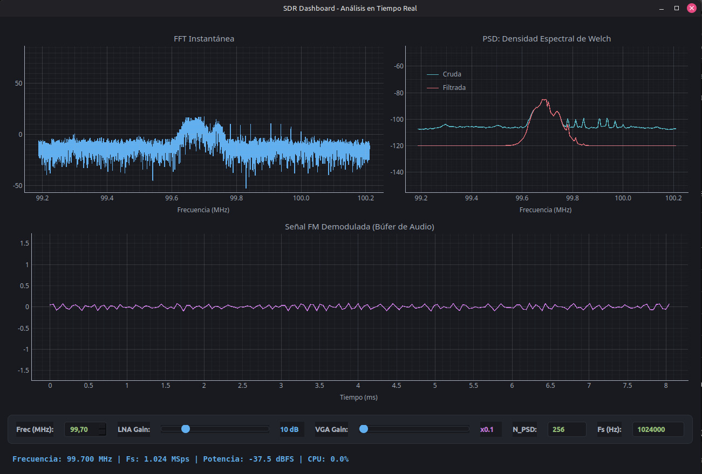
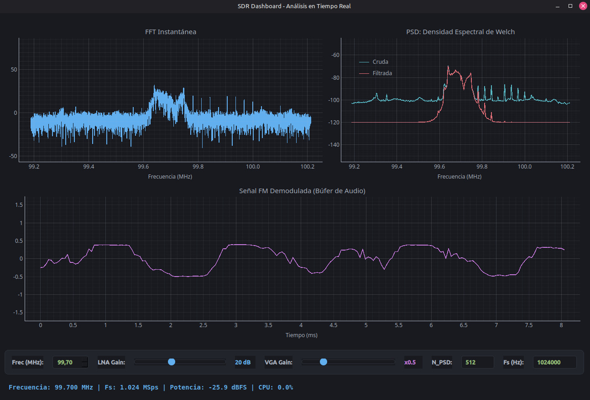
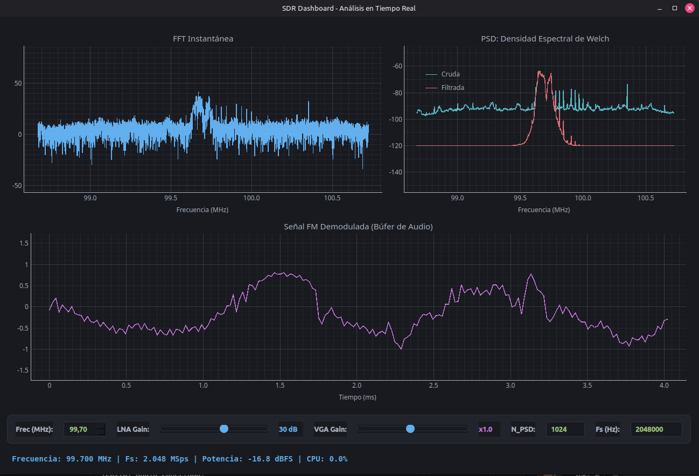
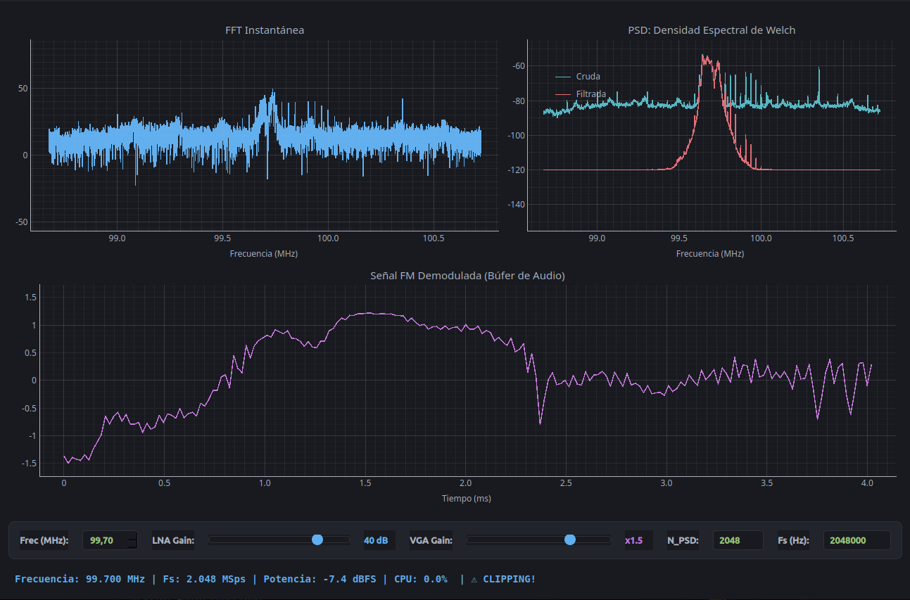
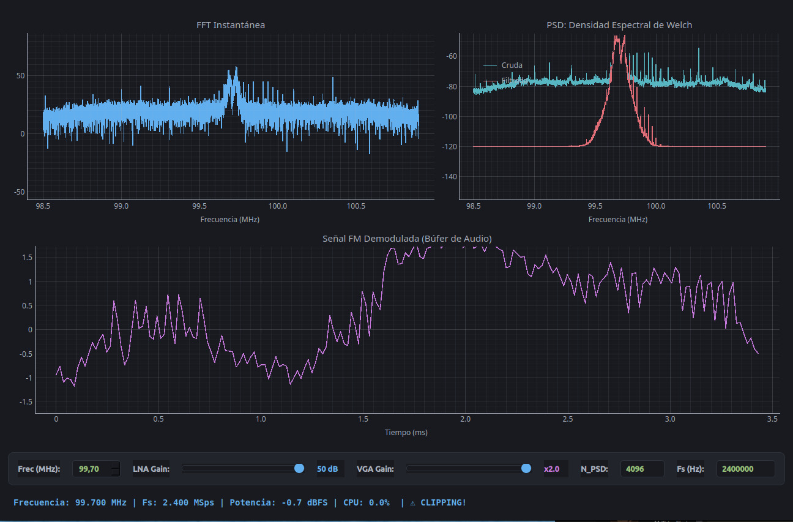

# Observación espectral de señales FM utilizando RTL-SDR
## FFT instantánea, PSD por Periodograma y Welch

**Informe de Laboratorio**

**Presentado por:**
* Marlyn Nathalia Mora Riasco
* Hernan Jair Telpiz Cuaran
* Brayan Manuel Gallego Ocampo

**Teoría de Señales**  
Universidad Nacional de Colombia  
20 de mayo de 2026

---

## 1. Introducción
Las radios definidas por software (SDR) permiten implementar mediante software diferentes etapas de procesamiento de señales que tradicionalmente se realizaban con hardware especializado.

En esta práctica se utilizó una RTL-SDR para capturar señales FM reales y realizar análisis espectral en tiempo real mediante técnicas de procesamiento digital de señales implementadas en Python.

A partir de muestras complejas I/Q se implementaron FFT instantánea, periodograma y el método de Welch, con el objetivo de analizar el comportamiento espectral de la señal, el piso de ruido y el costo computacional del sistema.

## 2. Objetivos

### 2.1. Objetivo general
Analizar señales FM utilizando una RTL-SDR mediante técnicas de procesamiento digital de señales.

### 2.2. Objetivos específicos
* Capturar muestras complejas I/Q usando una RTL-SDR.
* Implementar FFT instantánea, periodograma y Welch para análisis espectral.
* Analizar el efecto de la ganancia sobre la señal y el piso de ruido.
* Evaluar el desempeño computacional del sistema en tiempo real.

## 3. Marco Teórico

### 3.1. FFT instantánea
La Transformada Rápida de Fourier (FFT) permite analizar el contenido frecuencial de una señal discreta a partir de un bloque de muestras.

Para una señal $x[n]$ de longitud $N$, la FFT se define como:

$$ X[k] = \sum_{n=0}^{N-1} x[n]e^{-j2\pi kn/N} \quad (1) $$

La FFT instantánea permite visualizar cambios rápidos en el espectro de la señal, aunque presenta alta variabilidad debido a que utiliza un único bloque de datos.

### 3.2. Ventaneo y fuga espectral
Al procesar bloques finitos de muestras pueden aparecer discontinuidades en los extremos de la señal, generando fuga espectral.

Para reducir este efecto se empleó una ventana Hann:

$$ w[n] = \frac{1}{2} \left( 1 - \cos\left(\frac{2\pi n}{N - 1}\right) \right) \quad (2) $$

El uso de esta ventana disminuye la dispersión de energía hacia frecuencias vecinas y mejora la estimación espectral.

### 3.3. PSD por periodograma
El periodograma es un método utilizado para estimar la densidad espectral de potencia (PSD) de una señal.

Este método calcula la potencia espectral a partir de la FFT de un bloque de muestras previamente ventaneado.

El periodograma proporciona una representación más estable que la FFT instantánea, aunque todavía presenta fluctuaciones debido al uso de un único bloque de datos.

### 3.4. Método de Welch
El método de Welch mejora la estimación espectral mediante el promedio de varios periodogramas calculados sobre segmentos de la señal.

Este método reduce la variabilidad espectral y permite observar con mayor claridad la distribución de potencia y el piso de ruido.

Sin embargo, el cálculo de múltiples FFT incrementa el costo computacional del sistema.

### 3.5. Demodulación FM
La demodulación FM permite recuperar la señal modulante a partir de variaciones de fase presentes en las muestras complejas I/Q capturadas por la RTL-SDR.

En esta práctica se utilizó demodulación basada en la diferencia de fase entre muestras consecutivas, permitiendo obtener la señal de audio correspondiente a la emisora FM capturada.

## 4. Metodología

Para el desarrollo de la práctica se utilizó una RTL-SDR conectada a un computador para capturar señales FM reales en la banda comercial.

El sistema fue implementado en Python utilizando librerías de procesamiento digital de señales, visualización gráfica y adquisición en tiempo real. A partir de las muestras complejas I/Q obtenidas desde la RTL-SDR, el flujo de la señal se divide en dos ramas principales: análisis espectral y demodulación de audio.

En la versión final del sistema se integró toda la visualización en un **dashboard unificado** compuesto por tres paneles: FFT instantánea, PSD por Welch con curvas cruda y filtrada, y señal FM demodulada. El periodograma fue descartado del sistema final dado que la estimación por Welch ofrece mayor estabilidad espectral.

**Diagrama de bloques del sistema:**

### 4.1. Parámetros de adquisición

| Parámetro | Valor |
|---|---|
| Frecuencia central | 99.7 MHz |
| LNA Gain | Variable (10 dB – 50 dB) |
| VGA Gain | Variable (×2.0 como base) |
| Tasa de muestreo (Fs) | 2.048 MSps |
| N_PSD (puntos Welch) | 1024 |
| Procesamiento | Tiempo real |

*Cuadro 1: Parámetros principales de adquisición*

### 4.2. Procesamiento espectral

Las muestras I/Q capturadas fueron procesadas mediante dos métodos principales:

* FFT instantánea.
* PSD mediante el método de Welch, visualizando simultáneamente la señal cruda y la señal filtrada.

Adicionalmente, se realizó demodulación FM y visualización temporal de la señal de audio en el panel inferior del dashboard.

### 4.3. Monitoreo computacional

El sistema registró métricas en tiempo real en la barra inferior del dashboard, incluyendo:

* uso de CPU,
* memoria RAM,
* frecuencia central sintonizada,
* potencia de la señal en dBFS,
* piso de ruido estimado.
### 5. Resultados experimentales
### 5.1. Variación de parámetros combinados

Con el fin de analizar el comportamiento del sistema SDR de forma integral, se realizaron cinco pruebas variando simultáneamente la ganancia LNA, la ganancia VGA, el número de puntos de Welch (N_PSD) y la tasa de muestreo (Fs).

| Captura | LNA | VGA | Fs (Hz) | N_PSD | Potencia | Clipping |
|---|---|---|---|---|---|---|
| 1 | 10 dB | x0.1 | 1.024.000 | 256 | -37.5 dBFS | No |
| 2 | 20 dB | x0.5 | 1.024.000 | 512 | -25.9 dBFS | No |
| 3 | 30 dB | x1.0 | 2.048.000 | 1024 | -16.8 dBFS | No |
| 4 | 40 dB | x1.5 | 2.048.000 | 2048 | -7.4 dBFS | Sí |
| 5 | 50 dB | x2.0 | 2.400.000 | 4096 | -0.7 dBFS | Sí |

*Cuadro 2: Parámetros y métricas de cada prueba experimental*

### LNA 10 dB, VGA x0.1, N_PSD 256, Fs 1.024 MSps

 

 

**Figura 2: Dashboard con LNA 10 dB, VGA x0.1, N_PSD 256, Fs 1.024 MSps**

Con la configuración mínima de ganancia y resolución espectral, la señal FM capturada presentó la menor potencia registrada de -37.5 dBFS. En el panel de FFT instantánea se observó un pico débil alrededor de 99.7 MHz con alta variabilidad y amplitud reducida. La PSD de Welch mostró el piso de ruido más bajo de todas las pruebas aproximadamente en -105 dB/Hz, aunque la curva cruda presentó escasa resolución espectral debido al bajo valor de N_PSD de 256 puntos. La señal FM demodulada fue prácticamente plana con amplitud cercana a cero, confirmando que la ganancia mínima no permitió una demodulación funcional.

#### LNA 20 dB, VGA x0.5, N_PSD 512, Fs 1.024 MSps

 

 

**Figura 3: Dashboard con LNA 20 dB, VGA x0.5, N_PSD 512, Fs 1.024 MSps**

Al incrementar la ganancia LNA a 20 dB y la resolución espectral N_PSD a 512 puntos, la potencia registrada en banda base aumentó a -25.9 dBFS. En el panel de PSD de Welch, el aumento de N_PSD mejoró notablemente la resolución en frecuencia, permitiendo definir con mayor claridad la forma del lóbulo principal de la emisora. El piso de ruido de la señal cruda (curva azul) se elevó ligeramente y se observa estable alrededor de -100 dB/Hz. En el dominio temporal, a diferencia del caso de 10 dB, la señal de audio demodulada ya presenta variaciones de amplitud estructuradas (oscilando entre -0.5 y 0.4 aproximadamente). Esto indica que la relación señal a ruido es suficiente para que el discriminador recupere la señal modulante, estableciendo esta configuración como el umbral mínimo de recepción funcional.

#### LNA 30 dB, VGA x1.0, N_PSD 1024, Fs 2.048 MSps

 

 

**Figura 4: Dashboard con LNA 30 dB, VGA x1.0, N_PSD 1024, Fs 2.048 MSps**

Con una ganancia de 30 dB, el sistema alcanzó un punto de operación nominal. La tasa de muestreo (Fs) se incrementó a 2.048 MSps y la resolución N_PSD a 1024 puntos, lo que expandió el ancho de banda analizado y mejoró la definición de las componentes espectrales. La potencia registrada fue de -16.8 dBFS, indicando una recepción sólida sin llegar a saturar el conversor (no hay indicador de clipping en la interfaz). El piso de ruido en la PSD de Welch subió a aproximadamente -92 dB/Hz, pero la amplitud del lóbulo principal creció en mayor proporción, mejorando la relación señal a ruido. En consecuencia, la señal demodulada presenta una excursión completa y bien definida, abarcando un rango dinámico desde -1.0 hasta 0.8, lo que representa la recuperación óptima del audio.

#### LNA 40 dB, VGA x1.5, N_PSD 2048, Fs 2.048 MSps

 

 

**Figura 5: Dashboard con LNA 40 dB, VGA x1.5, N_PSD 2048, Fs 2.048 MSps**

Al incrementar la ganancia LNA a 40 dB y la VGA a x1.5, la potencia escaló a -7.4 dBFS. En este punto, la interfaz despliega la alerta de "CLIPPING!", indicando que las muestras I/Q están excediendo el rango dinámico del ADC del receptor. Aunque se incrementó N_PSD a 2048 puntos para obtener mayor resolución frecuencial, el exceso de ganancia provocó una elevación notable del piso de ruido en la PSD de Welch (aproximándose a -80 dB/Hz) y la aparición de ruido fuera de banda causado por la distorsión no lineal. La señal temporal de audio comienza a mostrar deformaciones bruscas y picos de alta frecuencia, lo que en la práctica se traduce en pérdida de fidelidad y ruido audible.

#### LNA 50 dB, VGA x2.0, N_PSD 4096, Fs 2.400 MSps

 

 

**Figura 6: Dashboard con LNA 50 dB, VGA x2.0, N_PSD 4096, Fs 2.400 MSps**

Bajo la configuración máxima de ganancia (LNA 50 dB, VGA x2.0), el sistema operó en un estado de saturación severa, registrando una potencia de -0.7 dBFS (prácticamente el límite de escala completa de 0 dBFS). A pesar de emplear la máxima resolución disponible (N_PSD de 4096 puntos y Fs de 2.4 MSps), el espectro calculado por el método de Welch se encuentra altamente degradado por armónicos artificiales y fuga espectral derivados del recorte (*clipping*) de la señal en banda base. La señal demodulada se encuentra totalmente destruida, presentando una forma de onda errática, angulosa y sin la envolvente continua propia del audio FM. 

### 5.2 Análisis general del compromiso de ganancia

Los resultados experimentales demuestran el compromiso de diseño inherente a los sistemas SDR de bajo costo. Una ganancia deficiente (10 dB) no logra superar el piso de ruido térmico, imposibilitando la demodulación. Un valor óptimo (20 a 30 dB) maximiza la relación señal a ruido (SNR) y permite la correcta recuperación de la modulante sin saturar el frontend de RF. Por el contrario, un exceso de ganancia (40 a 50 dB) fuerza al ADC fuera de su región lineal, introduciendo recorte que los algoritmos de procesamiento digital (como Welch) no pueden corregir, ya que procesan datos matemáticamente corrompidos desde la etapa de adquisición.

### 5.3 Análisis de costo computacional

El despliegue de algoritmos DSP en tiempo real exige que el tiempo total de procesamiento por ciclo ($T_{ciclo}$) sea estrictamente menor al tiempo de actualización requerido para evitar la pérdida de muestras. Según la dinámica del sistema evaluado:

$$T_{ciclo} = T_{captura} + T_{DSP} + T_{graficas}$$

Durante la ejecución del dashboard unificado, se monitorearon las métricas del proceso. Al escalar los parámetros hacia la configuración de mayor carga computacional (N_PSD = 4096, Fs = 2.4 MSps), el método de Welch demandó el cálculo de múltiples transformadas rápidas de Fourier (FFT) por cada actualización, impactando el $T_{DSP}$.

| Métrica | Valor Observado (Aprox.) |
|---|---|
| Memoria RAM (Proceso Python) | [LLENAR VALOR] MB |
| Uso de CPU (Proceso Python) | [LLENAR VALOR] % |
| Tiempo de Captura ($T_{captura}$) | [LLENAR VALOR] ms |
| Tiempo DSP ($T_{DSP}$) | [LLENAR VALOR] ms |
| Tiempo Total de Ciclo ($T_{ciclo}$) | [LLENAR VALOR] ms |

*Cuadro 3: Métricas computacionales del sistema*

A pesar del incremento en el costo computacional asociado al cálculo del promedio de periodogramas en el método de Welch y al filtrado digital de la señal, el sistema logró mantener una actualización estable en la interfaz gráfica. Se evidenció que la renderización gráfica de Matplotlib ($T_{graficas}$) representa uno de los cuellos de botella más críticos en aplicaciones SDR basadas en Python.

## 6. Conclusiones

1. La RTL-SDR demostró ser una herramienta de adquisición de hardware eficaz al trasladar la complejidad de la sintonía, filtrado y demodulación hacia el dominio de software mediante muestras $I/Q$ en banda base. No obstante, su rango dinámico es limitado y altamente susceptible a la saturación (clipping) si no se calibra la ganancia analógica adecuadamente.
2. La evaluación de estimadores espectrales confirmó que, mientras la FFT instantánea reacciona rápidamente a transitorios, la Densidad Espectral de Potencia calculada mediante el método de Welch ofrece una representación significativamente más estable. La segmentación y promediado de periodogramas logran minimizar la varianza del piso de ruido, exigiendo a cambio un mayor costo computacional.
3. El barrido paramétrico de ganancia comprobó la existencia de un compromiso ineludible en el diseño del receptor. Las ganancias bajas sumergen la señal por debajo del piso de ruido térmico, mientras que las ganancias excesivas empujan al ADC a su región no lineal. Este último estado produce recortes que generan fuga espectral y armónicos artificiales, destruyendo la señal modulante de audio, un daño físico irreparable mediante software.