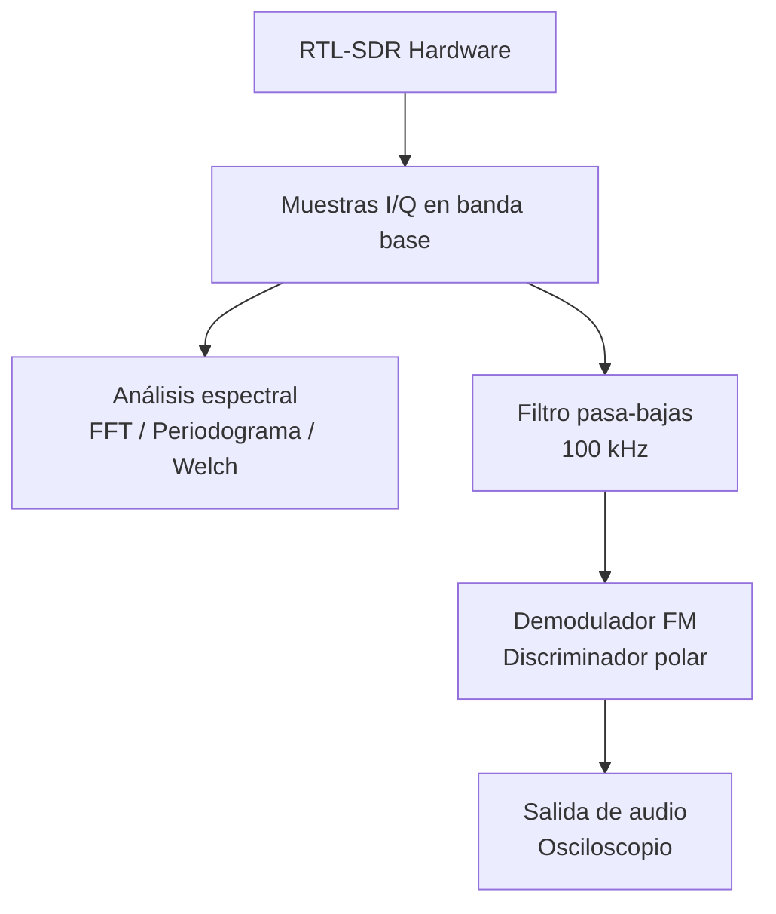
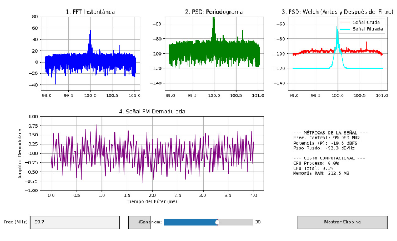
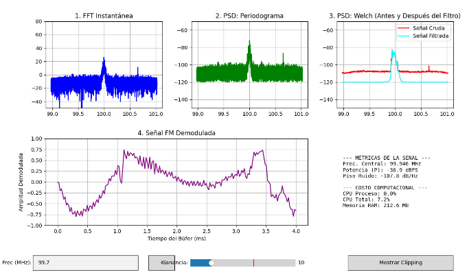
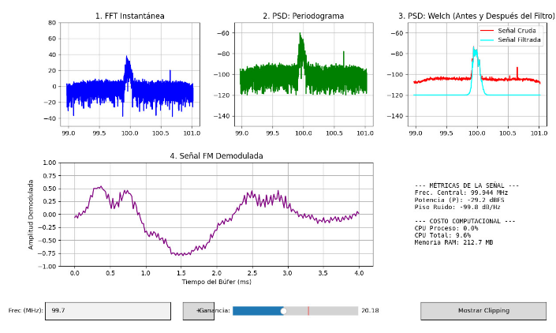
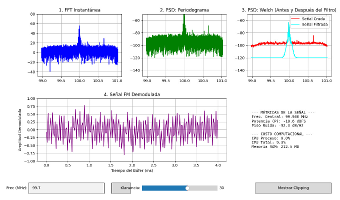
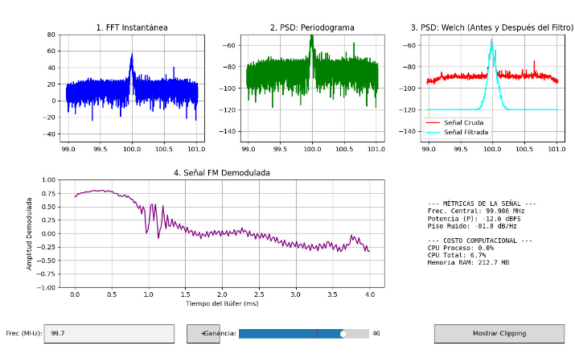
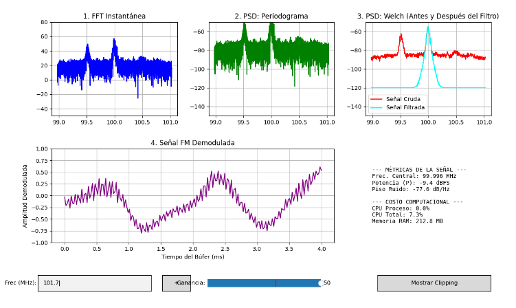

# Observación espectral de señales FM utilizando RTL-SDR
## FFT instantánea, PSD por Periodograma y Welch

**Informe de Laboratorio**

**Presentado por:**
* Marlyn Nathalia Mora Riascos
* Hernan Jair Telpiz Cuaran
* Brayan Manuel Gallego Ocampo

**Teoría de Señales**  
Universidad Nacional de Colombia  
20 de mayo de 2026

---

## 1. Introducción
Las radios definidas por software (SDR) permiten implementar mediante software diferentes etapas de procesamiento de señales que tradicionalmente se realizaban con hardware especializado.

En esta práctica se utilizó una RTL-SDR para capturar señales FM reales y realizar análisis espectral en tiempo real mediante técnicas de procesamiento digital de señales implementadas en Python.

A partir de muestras complejas I/Q se implementaron FFT instantánea, periodograma y el método de Welch, con el objetivo de analizar el comportamiento espectral de la señal, el piso de ruido y el costo computacional del sistema.

## 2. Objetivos

### 2.1. Objetivo general
Analizar señales FM utilizando una RTL-SDR mediante técnicas de procesamiento digital de señales.

### 2.2. Objetivos específicos
* Capturar muestras complejas I/Q usando una RTL-SDR.
* Implementar FFT instantánea, periodograma y Welch para análisis espectral.
* Analizar el efecto de la ganancia sobre la señal y el piso de ruido.
* Evaluar el desempeño computacional del sistema en tiempo real.

## 3. Marco Teórico

### 3.1. FFT instantánea
La Transformada Rápida de Fourier (FFT) permite analizar el contenido frecuencial de una señal discreta a partir de un bloque de muestras.

Para una señal $x[n]$ de longitud $N$, la FFT se define como:

$$ X[k] = \sum_{n=0}^{N-1} x[n]e^{-j2\pi kn/N} \quad (1) $$

La FFT instantánea permite visualizar cambios rápidos en el espectro de la señal, aunque presenta alta variabilidad debido a que utiliza un único bloque de datos.

### 3.2. Ventaneo y fuga espectral
Al procesar bloques finitos de muestras pueden aparecer discontinuidades en los extremos de la señal, generando fuga espectral.

Para reducir este efecto se empleó una ventana Hann:

$$ w[n] = \frac{1}{2} \left( 1 - \cos\left(\frac{2\pi n}{N - 1}\right) \right) \quad (2) $$

El uso de esta ventana disminuye la dispersión de energía hacia frecuencias vecinas y mejora la estimación espectral.

### 3.3. PSD por periodograma
El periodograma es un método utilizado para estimar la densidad espectral de potencia (PSD) de una señal.

Este método calcula la potencia espectral a partir de la FFT de un bloque de muestras previamente ventaneado.

El periodograma proporciona una representación más estable que la FFT instantánea, aunque todavía presenta fluctuaciones debido al uso de un único bloque de datos.

### 3.4. Método de Welch
El método de Welch mejora la estimación espectral mediante el promedio de varios periodogramas calculados sobre segmentos de la señal.

Este método reduce la variabilidad espectral y permite observar con mayor claridad la distribución de potencia y el piso de ruido.

Sin embargo, el cálculo de múltiples FFT incrementa el costo computacional del sistema.

### 3.5. Demodulación FM
La demodulación FM permite recuperar la señal modulante a partir de variaciones de fase presentes en las muestras complejas I/Q capturadas por la RTL-SDR.

En esta práctica se utilizó demodulación basada en la diferencia de fase entre muestras consecutivas, permitiendo obtener la señal de audio correspondiente a la emisora FM capturada.

## 4. Metodología
Para el desarrollo de la práctica se utilizó una RTL-SDR conectada a un computador para capturar señales FM reales en la banda comercial.

El sistema fue implementado en Python utilizando librerías de procesamiento digital de señales, visualización gráfica y adquisición en tiempo real. A partir de las muestras complejas I/Q obtenidas desde la RTL-SDR, el flujo de la señal se divide en dos ramas principales: análisis espectral y demodulación de audio.

**Diagrama de bloques del sistema:**

### 4.1. Parámetros de adquisición
Durante la práctica se configuraron diferentes parámetros de adquisición para analizar el comportamiento espectral de la señal.

| Parámetro | Valor |
|---|---|
| Frecuencia central | 100 MHz |
| Ganancia manual | 30 dB |
| Ancho de banda FM | 75 kHz |
| Procesamiento | Tiempo real |

*Cuadro 1: Parámetros principales de adquisición*

### 4.2. Procesamiento espectral
Las muestras I/Q capturadas fueron procesadas mediante tres métodos principales:
* FFT instantánea.
* PSD mediante periodograma.
* PSD mediante el método de Welch.

Además, se realizó demodulación FM y visualización temporal de la señal obtenida.

### 4.3. Monitoreo computacional
El sistema registró métricas relacionadas con el desempeño computacional, incluyendo:
* uso de CPU,
* memoria RAM,
* tiempo de captura,
* tiempo de procesamiento DSP,
* tiempo total de ciclo.

Estas métricas permitieron evaluar el comportamiento del sistema en tiempo real y analizar el impacto computacional del procesamiento espectral.

## 5. Resultados Experimentales

 

 

**Figura 1: Visualización general del sistema SDR implementado**

### 5.1. FFT instantánea
La FFT instantánea permitió observar el comportamiento espectral de la señal FM capturada alrededor de la frecuencia central de 99.7 MHz.

Se observó un pico dominante correspondiente a la emisora capturada, además de fluctuaciones rápidas en el espectro debido al uso de un único bloque de muestras.

También se evidenció la presencia de componentes de ruido distribuidas alrededor de la señal principal.

### 5.2. PSD mediante periodograma
El periodograma permitió estimar la densidad espectral de potencia de la señal utilizando ventaneo Hann.

En comparación con la FFT instantánea, el periodograma presentó una representación más estable del espectro y permitió identificar con mayor claridad el piso de ruido.

El piso de ruido estimado fue aproximadamente:

$$ N_{floor} \approx -92,3 \text{ dB/Hz} \quad (3) $$

### 5.3. PSD mediante Welch
El método de Welch produjo la estimación espectral más estable debido al promedio de múltiples segmentos de la señal.

La señal filtrada presentó reducción significativa del ruido fuera de banda y menor variabilidad espectral respecto al periodograma y la FFT instantánea.

Además, se observó que el filtrado permitió aislar con mayor claridad la componente principal de la emisora FM.

### 5.4. Comparación entre FFT, periodograma y Welch
La FFT instantánea presentó mayor variabilidad entre actualizaciones debido a que utiliza un único bloque de muestras, aunque permitió observar cambios rápidos en el espectro.

El periodograma proporcionó una representación más estable de la PSD gracias al uso de ventaneo Hann.

Por otra parte, el método de Welch generó la estimación espectral más estable debido al promedio de múltiples segmentos, reduciendo significativamente las fluctuaciones y el ruido fuera de banda.

Sin embargo, Welch requirió mayor procesamiento computacional respecto a la FFT instantánea y el periodograma.

### 5.5. Señal FM demodulada
La señal FM demodulada presentó variaciones temporales continuas asociadas al contenido de audio de la emisora capturada.

La forma temporal obtenida indicó que la demodulación FM implementada funcionó correctamente, permitiendo recuperar la señal modulante a partir de las muestras complejas I/Q capturadas por la RTL-SDR.

### 5.6. Costo computacional
Las métricas computacionales obtenidas durante la ejecución del sistema fueron las siguientes:

| Métrica | Valor |
|---|---|
| CPU total | 9.3 % |
| Memoria RAM | 212.5 MB |
| Frecuencia central | 99.980 MHz |
| Potencia | -19.6 dBFS |
| Piso de ruido | -92.3 dB/Hz |

*Cuadro 2: Métricas computacionales y espectrales del sistema*

El sistema logró mantener funcionamiento estable en tiempo real con un consumo moderado de CPU y memoria RAM.

Además, el uso del método de Welch permitió mejorar la estabilidad espectral y reducir el ruido fuera de banda, aunque con un incremento moderado en el costo computacional.

### 5.7. Variación de ganancia
Con el fin de analizar el comportamiento del sistema SDR, se realizaron pruebas variando manualmente la ganancia de recepción entre 10 dB y 50 dB.

 

 

**Figura 2: Respuesta espectral del sistema con ganancia de 10 dB**

Para una ganancia de 10 dB se observó una señal con menor amplitud espectral y un piso de ruido reducido aproximadamente a:

$$ N_{floor} \approx -107,8 \text{ dB/Hz} \quad (4) $$

La FFT instantánea presentó menor amplitud en el pico principal, indicando una recepción más débil de la emisora FM.

 

 

**Figura 3: Respuesta espectral del sistema con ganancia de 20 dB**

Al aumentar la ganancia a 20 dB se observó un incremento en la amplitud espectral de la señal FM y una mejora en la relación señal a ruido.

El piso de ruido aumentó hasta aproximadamente:

$$ N_{floor} \approx -99,8 \text{ dB/Hz} \quad (5) $$

La señal demodulada presentó una forma temporal más estable respecto al caso anterior.

 

 

**Figura 4: Respuesta espectral del sistema con ganancia de 30 dB**

Con una ganancia de 30 dB se obtuvo una recepción estable de la emisora FM y un adecuado equilibrio entre potencia espectral y ruido.

La potencia registrada fue aproximadamente:

$$ P \approx -19,6 \text{ dBFS} \quad (6) $$

mientras que el piso de ruido fue cercano a:

$$ N_{floor} \approx -92,3 \text{ dB/Hz} \quad (7) $$

En esta condición se observó una señal demodulada continua y correctamente recuperada.

 

 

**Figura 5: Respuesta espectral del sistema con ganancia de 40 dB**

Al incrementar la ganancia a 40 dB aumentó significativamente la amplitud espectral de la señal capturada.

Sin embargo, también se observó incremento del piso de ruido hasta aproximadamente:

$$ N_{floor} \approx -81,8 \text{ dB/Hz} \quad (8) $$

Esto produjo una mayor dispersión espectral y aumento de fluctuaciones en la PSD.

 

 

**Figura 6: Respuesta espectral del sistema con ganancia de 50 dB y frecuencia de 101.7 MHz**

Con una ganancia de 50 dB se observó el mayor nivel de potencia espectral:

$$ P \approx -9,4 \text{ dBFS} \quad (9) $$

No obstante, el aumento excesivo de ganancia también elevó considerablemente el piso de ruido y generó deformaciones visibles en el espectro.

Además, al cambiar la frecuencia central hacia 101.7 MHz se identificó una distribución espectral distinta, evidenciando la capacidad del sistema para sintonizar diferentes emisoras FM manualmente.

### 5.8. Análisis general
A medida que la ganancia aumentó, la potencia de la señal capturada también incrementó progresivamente.

Sin embargo, este incremento produjo simultáneamente una elevación del piso de ruido y una reducción de estabilidad espectral.

Las pruebas realizadas mostraron que valores intermedios de ganancia, alrededor de 20 dB a 30 dB, ofrecieron el mejor compromiso entre calidad espectral, estabilidad y nivel de ruido.

Por otra parte, ganancias elevadas como 50 dB aumentaron considerablemente el ruido y produjeron mayor variabilidad en la señal demodulada.

Estos resultados evidencian el compromiso existente entre sensibilidad de recepción y estabilidad espectral en sistemas SDR de bajo costo como la RTL-SDR.

## 6. Conclusiones
La RTL-SDR permitió implementar un sistema funcional de análisis espectral y demodulación FM en tiempo real utilizando procesamiento digital de señales en Python.

La FFT instantánea permitió observar cambios rápidos en el espectro, mientras que el periodograma y especialmente el método de Welch proporcionaron estimaciones más estables de la densidad espectral de potencia.

El aumento de la ganancia produjo incremento de la potencia de la señal recibida, pero también elevó el piso de ruido y la variabilidad espectral, evidenciando el compromiso entre sensibilidad y estabilidad del sistema.

Las pruebas experimentales mostraron que valores intermedios de ganancia ofrecieron mejores condiciones de recepción respecto a configuraciones extremas.

La demodulación FM implementada permitió recuperar correctamente la señal temporal de audio a partir de las muestras complejas I/Q capturadas por la RTL-SDR.

Finalmente, el sistema presentó un costo computacional moderado y logró mantener operación estable en tiempo real durante las pruebas realizadas.
